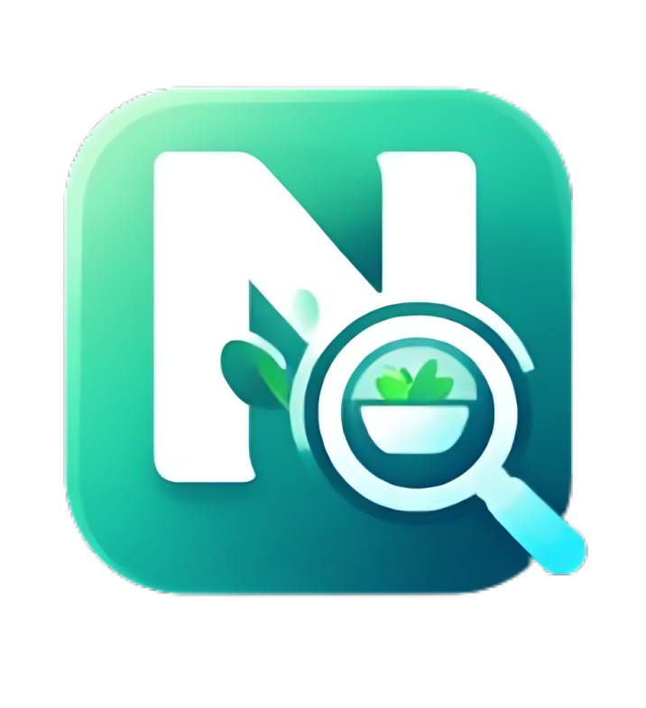

<p align="center">
  
</p>

<h1 align="center">NutriScan AI</h1>

<p align="center">
  <strong>🍽️ AI-Powered Nutrition Tracker & Health Companion — Built for Indian Diets</strong>
</p>

<p align="center">
  <a href="#features">Features</a> •
  <a href="#tech-stack">Tech Stack</a> •
  <a href="#architecture">Architecture</a> •
  <a href="#getting-started">Getting Started</a> •
  <a href="#api-reference">API Reference</a> •
  <a href="#contributing">Contributing</a> •
  <a href="#license">License</a>
</p>

<p align="center">
  
  
  
  
  
  
</p>

---

## 🌟 Overview

**NutriScan AI** is a full-stack, AI-powered nutrition tracking and health management platform designed specifically for **Indian dietary patterns**. It combines **computer vision** (TensorFlow.js MobileNet) for food recognition, **LLM-powered intelligence** (Groq/LLaMA 3.1) for personalized coaching, and a **comprehensive Indian food database** — all wrapped in a sleek, modern dark-mode UI.

Whether you're managing diabetes, trying to lose weight, or building muscle, NutriScan AI provides condition-aware meal suggestions, AI-generated weekly meal plans, and exportable medical reports — all tailored to your health profile.

---

## ✨ Features

### 🔍 Smart Food Scanning
- **Camera-based food detection** using TensorFlow.js MobileNet model
- **Image upload** with drag-and-drop support
- **Manual search** across a 100+ item Indian food database with alias support
- Adjustable servings and portion sizes (bowl, plate, piece, glass, cup)

### 📊 Health Dashboard
- **Real-time calorie, protein & fat tracking** with animated progress rings
- **BMI calculation** with health classification
- **Weekly weight trend graphs** powered by Recharts
- **Smart notifications** for low protein, calorie deficit, and missed meals
- **Food log history** with daily and historical views

### 🤖 AI-Powered Features
- **AI Nutrition Coach** — chatbot for personalized diet advice (Indian cuisine only)
- **AI Dinner Planner** — suggests condition-aware dinner ideas within remaining calorie budget
- **AI Recipe Generator** — generates healthy recipes from any ingredient
- **AI Weekly Meal Planner** — full 7-day meal plan with macro breakdowns
- **AI Medical Summary** — generates doctor-ready health summaries

### 📄 Medical Report Export
- **PDF report generation** with patient profile, nutrition summary, AI insights
- **Weight trend & calorie charts** embedded in the report (Chart.js server-side rendering)
- Downloadable with a single click

### 🎨 Premium UI/UX
- **Dark/Light mode** toggle with system preference support
- **Glassmorphism & gradient design** with Framer Motion animations
- **Responsive sidebar navigation** with icon-based nav
- **Condition-aware** UI adapts recommendations based on health profile

---

## 🛠️ Tech Stack

### Frontend
| Technology | Purpose |
|---|---|
| **React 19** | UI framework with hooks-based architecture |
| **Vite 7** | Lightning-fast build tool & dev server |
| **Tailwind CSS 4** | Utility-first CSS framework |
| **Framer Motion** | Animations & page transitions |
| **Recharts** | Interactive charts & data visualization |
| **Lucide React** | Modern icon library |
| **TensorFlow.js** | Client-side ML for food image recognition |
| **MobileNet** | Pre-trained image classification model |

### Backend
| Technology | Purpose |
|---|---|
| **Express 5** | REST API server |
| **Groq SDK** | LLaMA 3.1 8B inference via Groq Cloud |
| **PDFKit** | Server-side PDF report generation |
| **Chart.js + Node Canvas** | Server-side chart rendering for reports |
| **Sharp** | Image processing |
| **Multer** | File upload handling |
| **CORS** | Cross-origin resource sharing |

---

## 🏗️ Architecture

```
nutriscan-ai/
├── public/
│   ├── logo-icon.png              # App logo
│   └── images/food/               # Food item images
│
├── src/                           # Frontend (React + Vite)
│   ├── App.jsx                    # Main app — Landing, Profile, Dashboard
│   ├── ai.js                      # API client for all AI endpoints
│   ├── main.jsx                   # React entry point
│   ├── index.css                  # Global styles
│   ├── components/
│   │   └── ThemeToggle.jsx        # Dark/Light mode toggle
│   ├── pages/
│   │   ├── MealPlannerPage.jsx    # AI weekly meal planner
│   │   └── RecipesPage.jsx        # AI recipe generator
│   ├── hooks/
│   │   └── useTheme.js            # Theme management hook
│   ├── data/food/                 # Indian food database
│   │   ├── foodDB.js              # Main DB aggregator
│   │   ├── protien.js             # Protein-rich foods
│   │   ├── carbs.js               # Carbohydrate foods
│   │   ├── fatFood.js             # Fat-rich foods
│   │   ├── mixed.js               # Mixed/combo dishes
│   │   ├── snacks.js              # Snack items
│   │   └── drinks.js              # Beverages
│   └── utils/
│       ├── tfVision.js            # TensorFlow.js MobileNet wrapper
│       └── resolveFood.js         # Food lookup & portion resolver
│
├── server/                        # Backend (Express)
│   ├── index.js                   # Server entry — all API routes
│   ├── chatbot.js                 # AI coach & medical summary (Groq)
│   ├── .env                       # Server environment variables
│   ├── routes/
│   │   └── mealPlan.js            # /api/meal-plan route
│   ├── util/
│   │   └── chartGenerator.js      # Chart.js server-side rendering
│   └── uploads/                   # Uploaded image storage
│
├── .env                           # Frontend environment variables
├── vite.config.js                 # Vite configuration
├── tailwind.config.js             # Tailwind CSS configuration
├── package.json                   # Dependencies & scripts
└── README.md
```

---

## 🚀 Getting Started

### Prerequisites

- **Node.js** >= 18.x
- **npm** >= 9.x
- A **Groq API Key** — [Get one free here](https://console.groq.com/)

### 1. Clone the Repository

```bash
git clone https://github.com/VaibhavJain77/nutriscan-ai.git
cd nutriscan-ai
```

### 2. Install Dependencies

```bash
npm install
```

### 3. Configure Environment Variables

**Frontend** — create `.env` in root:

```env
VITE_API_URL=http://localhost:5000
```

**Backend** — create `server/.env`:

```env
GROQ_API_KEY=your_groq_api_key_here
```

### 4. Start the Backend Server

```bash
node server/index.js
```

The backend will start on `http://localhost:5000`.

### 5. Start the Frontend Dev Server

```bash
npm run dev
```

The app will be available at `http://localhost:5173`.

---

## 📡 API Reference

All endpoints are served from the Express backend at `http://localhost:5000`.

### Health Check

| Method | Endpoint | Description |
|--------|----------|-------------|
| `GET` | `/` | Server health check |

### AI Endpoints

| Method | Endpoint | Description | Body |
|--------|----------|-------------|------|
| `POST` | `/api/chat` | AI nutrition coach | `{ message, profile }` |
| `POST` | `/api/recipe` | AI recipe generation | `{ food, goal, condition }` |
| `POST` | `/api/dinner` | AI dinner suggestion | `{ remainingCalories, dietType, condition, goal }` |
| `POST` | `/api/meal-plan` | 7-day meal plan | `{ calories, goal, condition, dietType }` |
| `POST` | `/api/meal` | Quick meal suggestion | `{ remainingCals, userProfile }` |

### Report

| Method | Endpoint | Description | Body |
|--------|----------|-------------|------|
| `POST` | `/api/report/pdf` | Export medical PDF report | `{ profile, nutrition }` |

### Example Request

```bash
curl -X POST http://localhost:5000/api/chat \
  -H "Content-Type: application/json" \
  -d '{
    "message": "Suggest a high protein dinner",
    "profile": {
      "dietType": "veg",
      "condition": "none",
      "goal": "muscle"
    }
  }'
```

---

## 🧠 AI Models Used

| Model | Provider | Purpose |
|-------|----------|---------|
| **LLaMA 3.1 8B Instant** | Groq Cloud | Chat, recipes, meal plans, dinner ideas, medical summaries |
| **MobileNet v2** | TensorFlow.js | Client-side food image classification |

> **Note:** AI features are powered by Groq's free tier. The first request after a cold start may take 1–2 minutes as the model warms up.

---

## 🍛 Indian Food Database

NutriScan AI includes a curated database of **100+ Indian food items** across 6 categories:

| Category | Examples |
|----------|----------|
| **Proteins** | Paneer bhurji, egg curry, chicken curry, dal fry, rajma |
| **Carbs** | Rice, roti, paratha, dosa, idli, poha, upma |
| **Fats** | Ghee, coconut chutney, fried snacks |
| **Mixed Dishes** | Biryani, khichdi, thali combos |
| **Snacks** | Samosa, pakora, bhel puri, vada pav |
| **Drinks** | Lassi, buttermilk, chai, nimbu pani |

Each entry includes per-serving values for **calories, protein, fats, and fiber**, along with aliases for fuzzy search matching.

---

## 📸 App Flow

```
┌─────────────┐     ┌──────────────────┐     ┌───────────────────┐
│  Landing     │────▶│  Profile Setup    │────▶│    Dashboard       │
│  Page        │     │  (Health Info)    │     │  (Main App)        │
└─────────────┘     └──────────────────┘     └───────────────────┘
                                                      │
                    ┌─────────────────────────────────┼──────────────────┐
                    │                 │                │                  │
              ┌─────▼─────┐   ┌──────▼──────┐  ┌─────▼──────┐  ┌───────▼───────┐
              │  Food Scan │   │  AI Coach   │  │  Recipes   │  │  Meal Planner │
              │  + Camera  │   │  Chatbot    │  │  Generator │  │  (7-Day)      │
              └────────────┘   └─────────────┘  └────────────┘  └───────────────┘
                    │
              ┌─────▼──────────┐
              │  Medical Report │
              │  PDF Export     │
              └────────────────┘
```

---

## 🧪 Available Scripts

| Command | Description |
|---------|-------------|
| `npm run dev` | Start Vite dev server with HMR |
| `npm run build` | Build production bundle |
| `npm run preview` | Preview production build locally |
| `npm run lint` | Run ESLint checks |
| `node server/index.js` | Start the Express backend |

---

## 🤝 Contributing

Contributions are welcome! Here's how you can help:

1. **Fork** the repository
2. **Create** a feature branch (`git checkout -b feature/amazing-feature`)
3. **Commit** your changes (`git commit -m 'Add amazing feature'`)
4. **Push** to the branch (`git push origin feature/amazing-feature`)
5. **Open** a Pull Request

---

## 📝 License

This project is open source and available under the [MIT License](LICENSE).

---

## 👨‍💻 Author

**Vaibhav Jain**

- GitHub: [@VaibhavJain77](https://github.com/VaibhavJain77)

---

<p align="center">
  <sub>Built with ❤️ and lots of 🍛 chai</sub>
</p>
